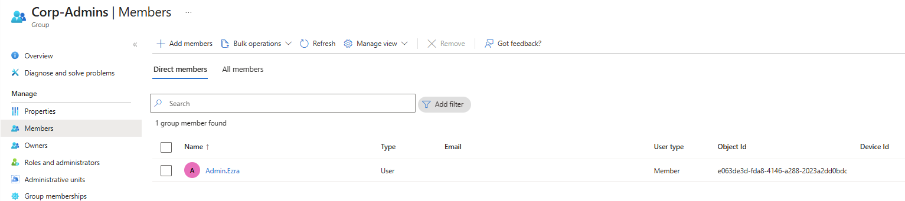
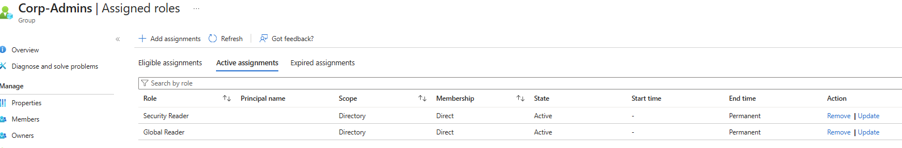
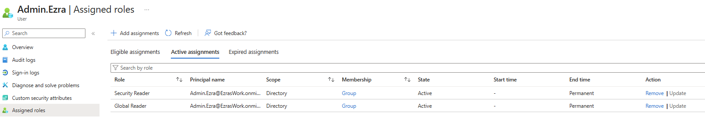
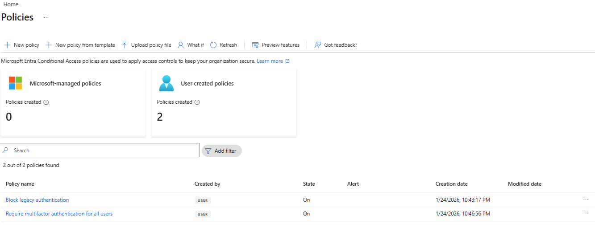
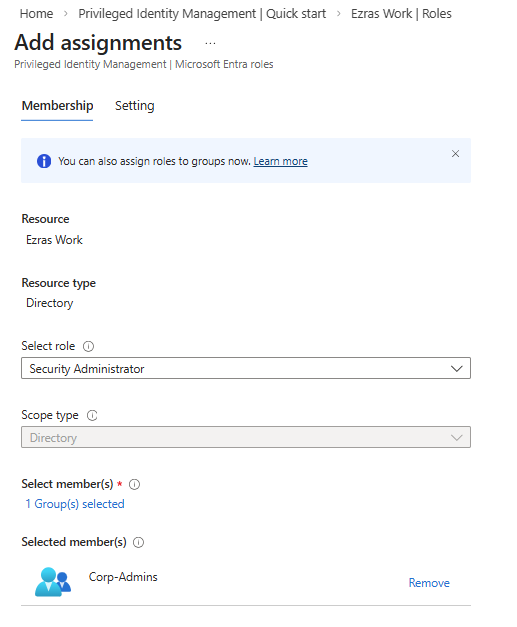
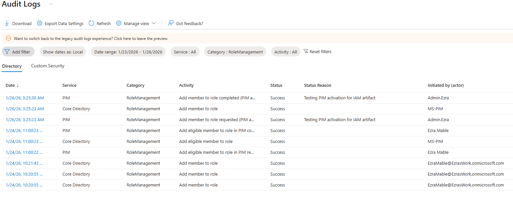

# Identity Governance Foundation (Artifact 1)
## &nbsp;&nbsp;&nbsp;&nbsp;&nbsp;&nbsp;This lab simulates a small organization transitioning from baseline identity protections to enterprise-grade governance. It demonstrates user provisioning, role-based access control, MFA enforcement, Conditional Access policy creation, and Privileged Identity Management workflows. Logs and screenshots validate each step, showing realistic authentication behavior across multiple personas and geographic locations.
## The project reflects hands-on experience with Microsoft Entra ID, including:
## - 	Security Defaults and Conditional Access
## - 	Role assignment via groups
## - 	PIM elevation and audit traceability
## - 	MFA registration and token behavior
## - 	Sign-in telemetry and policy enforcement

## Problem Statement
&nbsp;&nbsp;&nbsp;&nbsp;&nbsp;&nbsp;A small but growing organization lacks a structured identity and access management process. User accounts are created inconsistently, permissions accumulate over time, and there is no centralized visibility into authentication risks or access levels. This project designs and documents a lightweight IAM foundation that improves security, reduces operational friction, and prepares the organization for future scaling.
Implementation
Security Defaults were enabled to enforce MFA, block legacy authentication, and provide a baseline identity protection posture during the free tier phase. Example groups and users were created to simulate structure and assigned roles.

| User    | Group          |
|---------|----------------|
| Alice   | IT-Support     |
| Bob     | HR-Staff       |
| Charlie | Corp-Employees |
| Ezra    | Corp-Admins    |

| Group          | Roles to Assign                | Why                                    |
|----------------|------------------------------  |----------------------------------      |
| Corp-Admins    | Global Reader, Security Reader | Read-only admin visibility             |
| IT-Support     | User Administrator             | Identity operations (Tier 1)           |
| HR-Staff       | None                           | HR shouldn’t have directory privileges |
| Corp-Employees | None                           | Standard users                         |

&nbsp;&nbsp;&nbsp;&nbsp;&nbsp;&nbsp;Each user account was used to generate logs. Authentication behavior was validated. For example: Security Defaults enforces MFA at registration but does not require MFA for every sign in. After initial registration, Entra issues a Primary Refresh Token that reduces MFA frequency unless risk conditions change. Audit logs confirm user and group provisioning, as well as MFA registration for all personas. Sign-in logs show successful and failed authentication attempts across multiple personas and geographic locations. Conditional Access policies were evaluated, MFA was enforced, and location telemetry was captured. Interrupts and failures reflect realistic user behavior and policy enforcement. A location change (US → UK) was used to generate MFA prompts and demonstrate Conditional Access evaluation in the sign-in logs.
Security Defaults were disabled to allow granular Conditional Access policies and Privileged Identity Management workflows. This shift reflects a transition from baseline protections to enterprise-grade identity governance.
Conditional Access policies were created using Microsoft’s built-in templates and manually configured to enforce MFA and block legacy authentication. The Manage Policies view confirms active enforcement.
Privileged Identity Management was used to assign the Security Administrator role to the Corp-Admins group. Admin.Ezra activated the role through PIM’s just-in-time workflow, providing justification and time-bound elevation. This demonstrates least privilege and controlled access to sensitive administrative capabilities.
Audit logs were filtered by category to highlight key IAM events. Separate views confirm user provisioning, group-based role assignments, Conditional Access policy creation, and PIM activation. These logs validate administrative actions and support traceability across the identity lifecycle.
	

# The following screenshots support each implementation step and confirm policy enforcement, role activation, and audit traceability.

## Phase 1 — Setup

### Security Defaults ON

### Security Defaults OFF

### All Users in E5

### Security Groups in E5

### Group Membership in E5

### Assigned Roles: Admins

### Assigned Roles: Ezra

### Assigned Roles: IT Support

### Creating New Group and Roles in E5

## Phase 2 — Conditional Access

### Creating Conditional Access Policies

### Conditional Access Policy Confirmation

### Conditional Access Policy Audit Logs

## Phase 2 — PIM

### Group PIM Assignment

### Group PIM Confirmation

### Admin.Ezra Eligible Role

### Admin.Ezra Eligible Activation

### Admin.Ezra Elevated

## Phase 2 — Logs and Validation

### User Sign-in Logs

### Sign-in Events US and UK

### Elevation Audit Log

### UserManagement Audit Logs

### GroupManagement Audit Logs

### PIM Activation Audit Logs

<ul>
  <li><a href="https://www.ezras.work">Return to Main Page</a></li>
</ul>
