# Implementing Conditional Access and MFA in Microsoft Entra (Artifact 2)

## Introduction
For Artifact 2, I worked inside my Microsoft Entra ID E5 tenant to move from the broad, all‑or‑nothing protections of Security Defaults to a more flexible, policy‑driven access model using Conditional Access. The goal was to enforce MFA through policy, apply location‑based access controls, and design a break‑glass emergency access account. The screenshots included throughout this artifact document each configuration and validation step.

## Confirming Tenant and Administrator Context
I began by confirming that I was working in the correct tenant and that my administrative account had the necessary privileges.  
Screenshot reference: The tenant overview shows Ezras Work with my Global Administrator role active, validated through Privileged Identity Management.

This establishes the administrative context for all subsequent policy work.

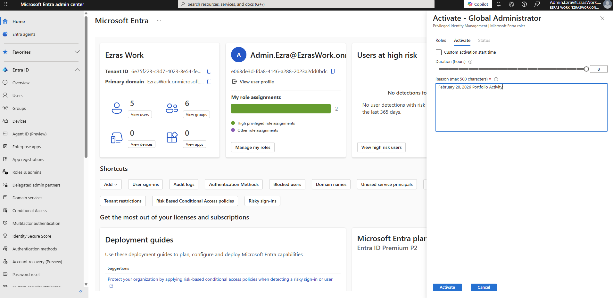

## Disabling Security Defaults
Security Defaults were previously disabled in Artifact 1. This is required because Security Defaults enforce MFA and other protections in an all‑or‑nothing manner, preventing granular Conditional Access policies from taking effect.

Screenshot reference: The Security Defaults page shows the setting as Disabled, with the reason “My organization is planning to use Conditional Access.”

This confirms that the tenant is ready for policy‑based MFA enforcement.

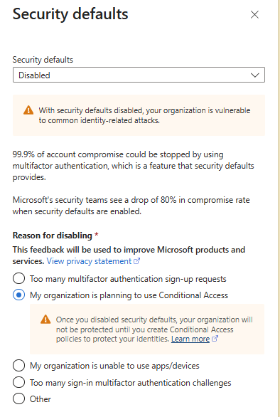

## CA01 – Require MFA for All Users
The first Conditional Access policy enforces MFA for all users in the tenant.

Configuration
- Users: All users  
- Cloud apps: All cloud apps  
- Grant controls: Grant access + Require multifactor authentication  
- State: Enabled  

Screenshot references:  
- The Conditional Access policy list shows Require multifactor authentication for all users in the “On” state.  

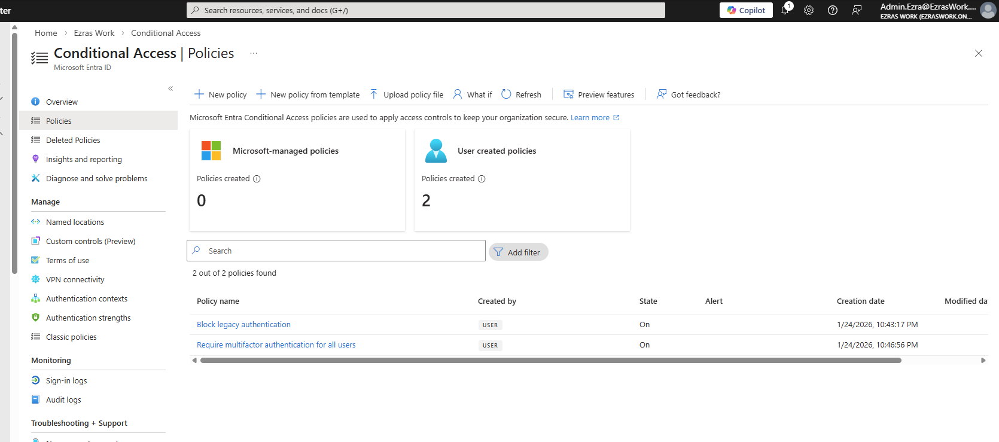

- The policy configuration screen shows the grant control with Require multifactor authentication selected.

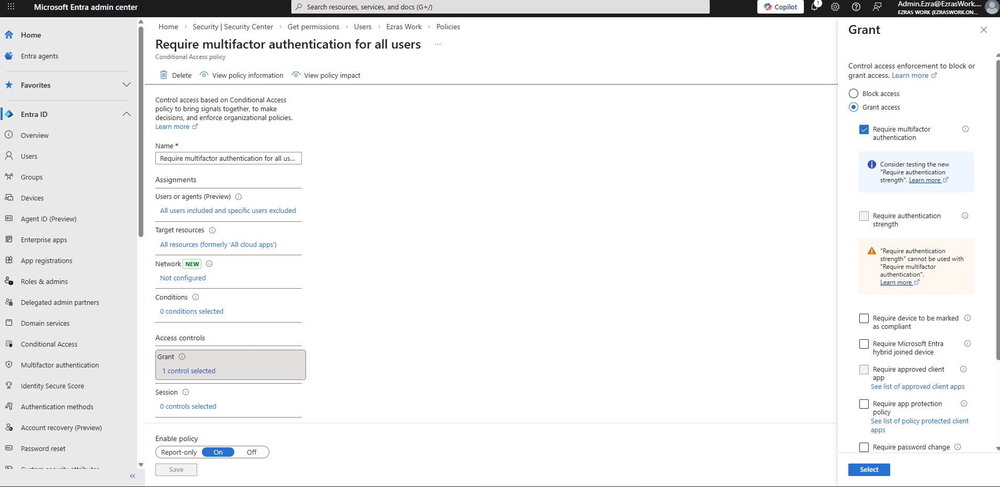

Testing
I signed in as a non‑admin test user (User.Charlie) in a private browser session.

Screenshot reference: The MFA prompt shows the Authenticator number‑matching challenge for user.charlie@ezraswork.onmicrosoft.com.

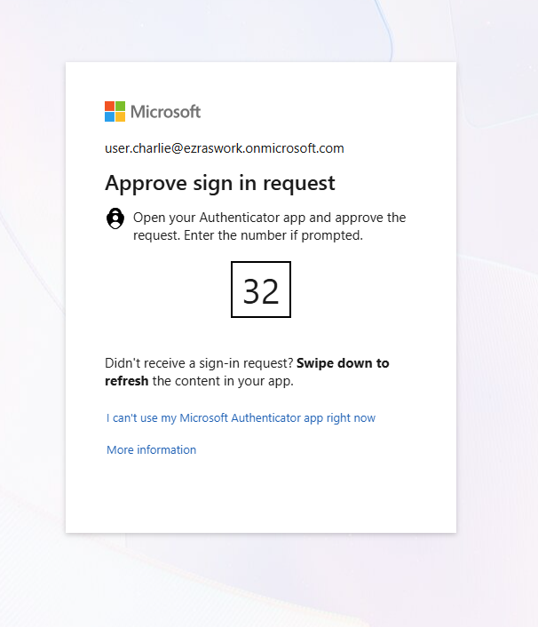

This confirms that CA01 successfully enforced MFA.

## CA02 – Block Sign‑In From Non‑US Locations
The second policy demonstrates location‑based access control.

Named Location Creation
I created a named location called US Only, configured using IP‑based country detection.

Screenshot reference: The Named Locations screen shows US Only with the United States selected.

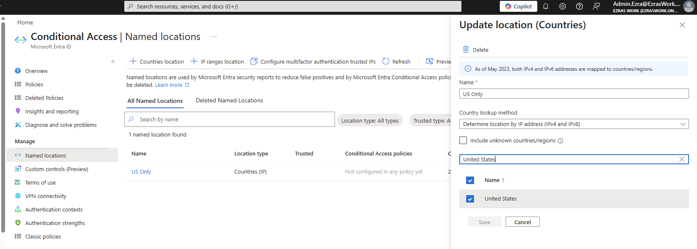

Policy Configuration
- Users: All users  
- Cloud apps: All cloud apps  
- Locations:  
  - Include: Any location  
  - Exclude: US Only  
- Grant controls: Block access  
- State: Enabled  

Screenshot references:  
- The policy list shows CA02 – Block sign‑in from non-US locations in the “On” state.

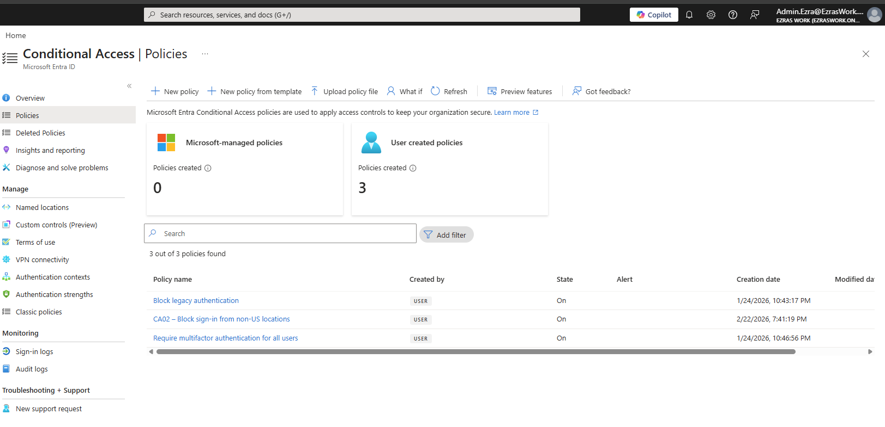

- The policy configuration screen shows the location condition with Any location included and US Only excluded.

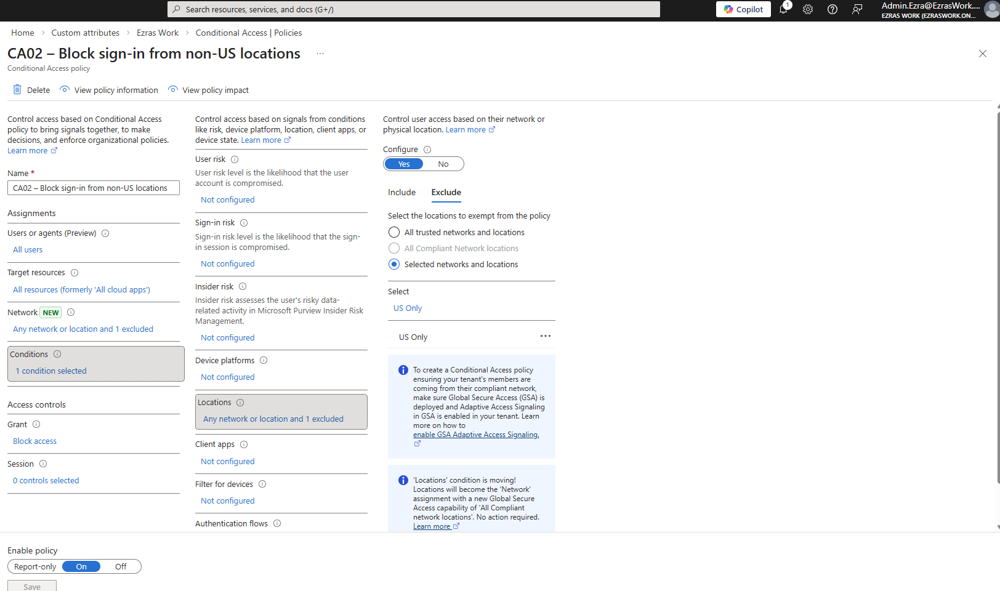

Testing
To validate the policy, I connected to a VPN endpoint outside the United States.

Screenshot reference:  
-	The sign‑in failure message for User.Charlie shows “You cannot access this right now,” while the VPN client is connected to a non‑US location.

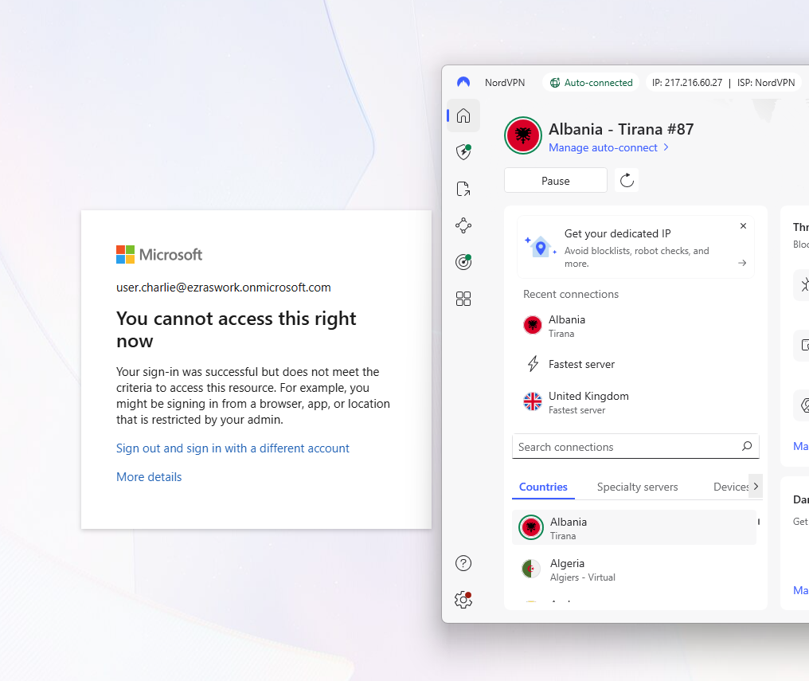

This demonstrates that CA02 correctly blocks sign‑ins originating outside the allowed region.

## Break‑Glass Emergency Access Account

A break‑glass account ensures that administrators can still access the tenant even if Conditional Access or MFA becomes overly restrictive. In real environments, these accounts are intentionally difficult to identify — they typically do not use obvious usernames like “breakglass” or “emergencyadmin.” Instead, they follow naming conventions that blend into the directory to avoid becoming easy targets during reconnaissance.

Creation and Role Assignment
I created BreakGlass@EzrasWork.onmicrosoft.com and assigned it the Global Administrator role.  
Screenshot reference: Assigned roles screen showing BreakGlass with an active Global Administrator assignment.

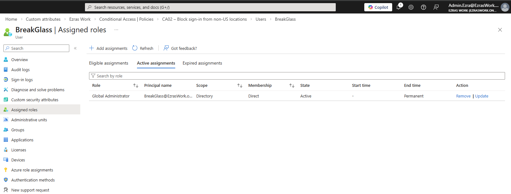

Excluding Break‑Glass From All CA Policies
I excluded the BreakGlass account from CA01, CA02, and the legacy authentication block policy.  
Screenshot references: Exclusion lists for each policy showing BreakGlass and my primary admin account.

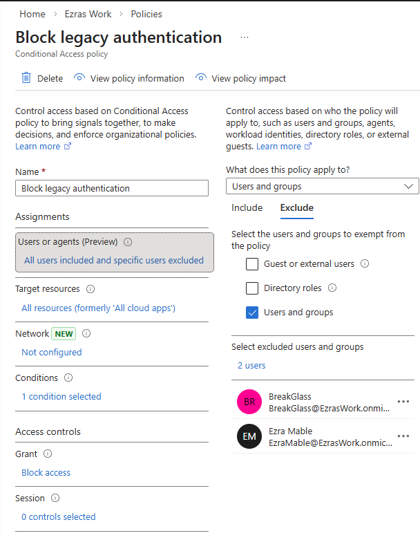

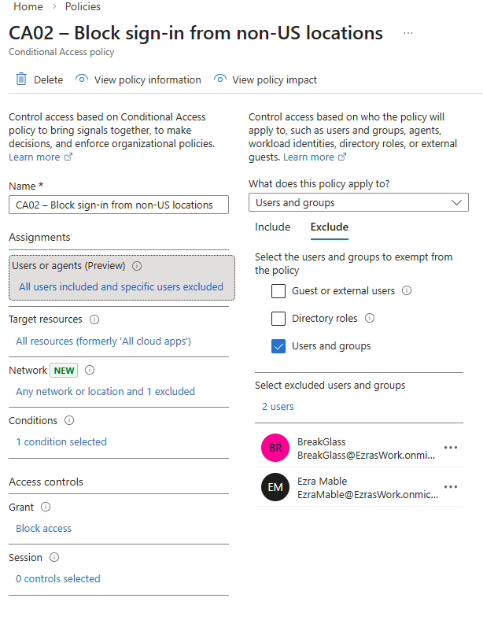

 can filter or enumerate accounts by role. Standard users — even those with elevated access in other systems — cannot list privileged identities or narrow down accounts by role assignment.

This prevents internal reconnaissance and reduces the risk that someone could identify or target emergency access accounts. I’ve seen this firsthand in a real corporate environment: without the proper directory role, you simply cannot filter users by “Global Administrator” or “Privileged Role” to discover who holds elevated access.

Validation
I tested the break‑glass account by signing in from a VPN endpoint outside the US.  
Screenshot references:  
- Azure sign‑in page for BreakGlass while connected to a non‑US VPN endpoint

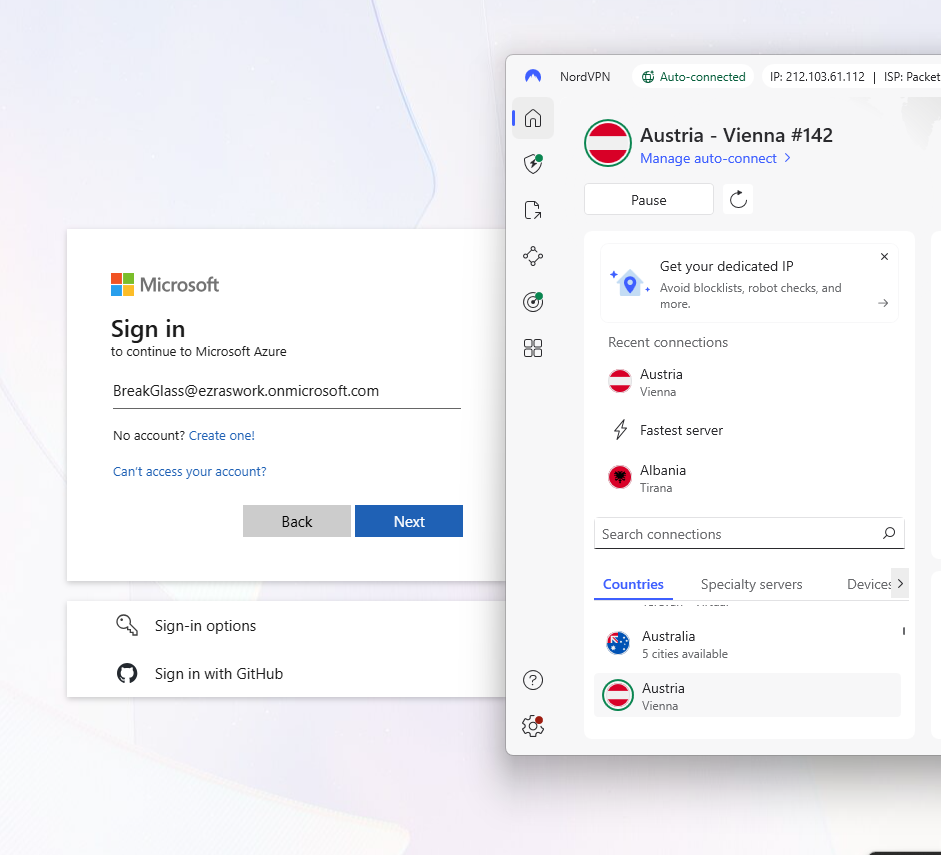

- Sign‑in logs showing successful BreakGlass access with Conditional Access: Not Applied

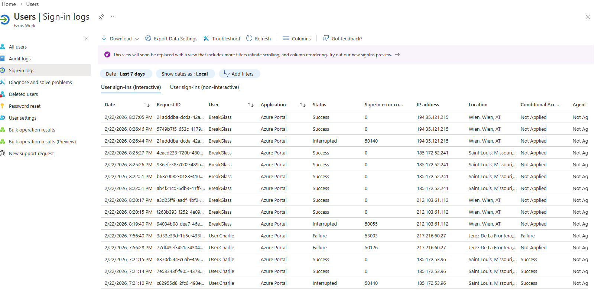

This confirms that the break‑glass account bypasses all Conditional Access policies and remains available for emergency use.

## Takeaways
This artifact demonstrates the core responsibilities of an IAM analyst:

- Designing identity controls  
- Implementing Conditional Access policies  
- Testing and validating policy behavior  
- Ensuring operational resilience through emergency access accounts  

By replacing Security Defaults with granular Conditional Access policies, enforcing MFA, restricting access based on location, and validating a break‑glass account, I built a secure and recoverable identity foundation inside my Entra tenant.

<ul>
  <li><a href="https://www.ezras.work">Return to Main Page</a></li>
</ul>
